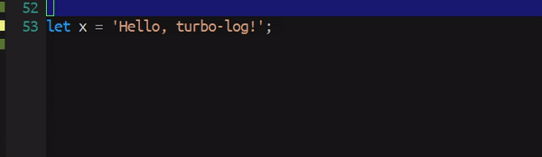

<a href="https://github.com/jcs-elpa/turbo-log"></a>

# turbo-log

[](https://travis-ci.com/jcs-elpa/turbo-log)
[](https://www.gnu.org/licenses/gpl-3.0)

This extension make debugging much easier by automating the operation of
writing meaningful log message.

<p align="center">
  
</p>

*P.S. Inspired by VSCode plugin, [Turbo Console Log](https://marketplace.visualstudio.com/items?itemName=ChakrounAnas.turbo-console-log).*

## How to use?

1. Region select a variable
2. `M-x turbo-log`

I would recommend you to bind command `turbo-log` to a keymap.

```el
(define-key [your-mode-map] (kbd "[key]") #'turbo-log)
```

## Add your favourite language?

The supported languages is listed `turbo-log-formats`. You can customize
`turbo-log-formats` variable  to add your own logging support for your
favourite language. Just add cons cell like (mode-name . log-string).

For instance, in JavaScript.

```el
(setq turbo-log-formats '((javascript-mode . "console.log(\"%s\" + %s);")))
```

The first `%s` is the prefix string for to see your log easier. The default
value is `╘[TL] variable-name: `. You can customize this behaviour, see
[here](https://github.com/jcs-elpa/turbo-log#customization). The second `%s`
is the actual variable name to print out the variable value.

```js
let x = 'Hello, turbo-log!';
console.log("╘[TL] x: " + x);  // This is generated by `turbo-log`!
```

## Customization

Here is a list of variables for you to customize to alter the behaviour of
this package.

| Name                         | Default    | Description                                       |
|:-----------------------------|:-----------|:--------------------------------------------------|
| `turbo-log-prefix`           | `"╘[TL] "` | Prefix string inserted before variable name.      |
| `turbo-log-prefix-delimiter` | `: `       | The delimiter between prefix and log.             |
| `turbo-log-prefix-intial`    | `t`        | If non-nil, have variable name to prefix initial. |
| `turbo-log-no-ask`           | `nil`      | If non-nil, do not ask prefix.                    |

## Contribution

If you would like to contribute to this project, you may either
clone and make pull requests to this repository. Or you can
clone the project and establish your own branch of this tool.
Any methods are welcome!
